# Athereum: Ethereum en AVA

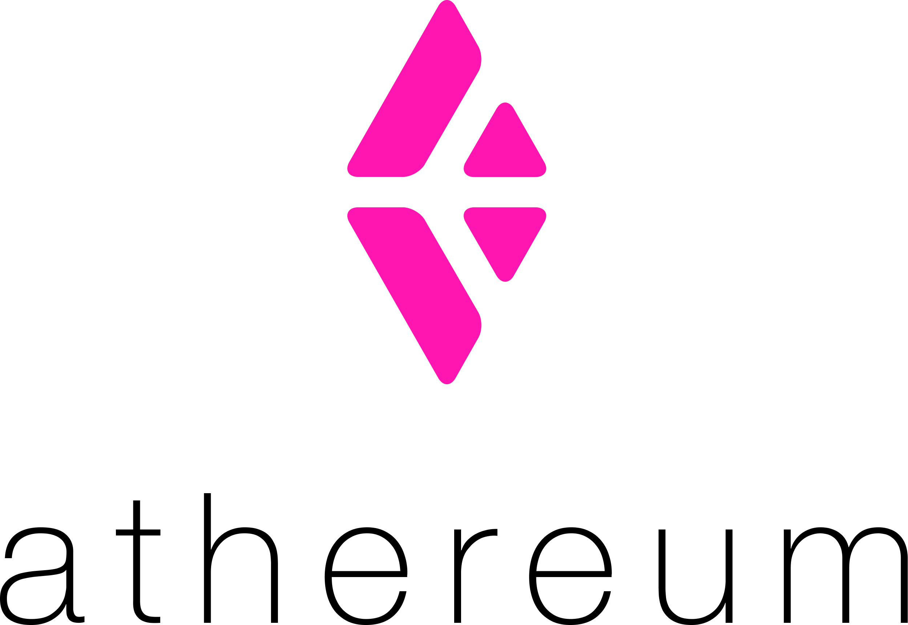

La Red AVA puede ofrecer la red de Consenso a cualquier número de plataformas descentralizadas. 
Para demostrarlo, hemos creado una fase inicial de despliegue de la red Ethereum. 
Hemos desplegado una red AVA muy pequeña de 25 nodos, donde hemos desplegado Athereum como una subred.

Hay una conexión RPC abierta disponible con todas las llamadas ETH JSON-RPC disponibles. 
Esta guía le muestra cómo acceder al RPC de demostración e interactuar con un contrato de demostración 
que hemos implementado para confirmar la operación. El contrato de demostración es una sencilla lotería, 
en la que usted se registra ("compra" un billete) con su clave pública, y al final el ganador es seleccionado "al azar" 
(es decir, nosotros elegimos manualmente uno al azar). Sí, un poco chiflado, pero está aquí para demostrar un objetivo.

Si desea ver el contrato en sí, haga clic [aquí](https://gist.github.com/StephenButtolph/732f30185fd97b026b53837c8f8042b1#file-registry-sol).
*Este contrato pretende ser simple, no seguro, por lo que los fondos no son #SAFU. O reales, para el caso. 
De nuevo, esto es sólo una prueba* :)

# Requisitos

Estaremos interactuando con el contrato usando MyEtherWallet. Necesitará una clave privada para interactuar con el 
contrato de demostración. Le sugerimos que utilice una clave privada generada aleatoriamente. Puede obtener dicha 
clave en https://vanity-eth.tk/ haciendo clic en el botón `Generate` en la parte inferior de la página. 
Después de eso, haga clic en `Private key: Click to reveal` y almacenar su clave privada para más tarde. 
**No debe utilizar su propia clave privada o Ethereum Keyfile por razones de seguridad.**

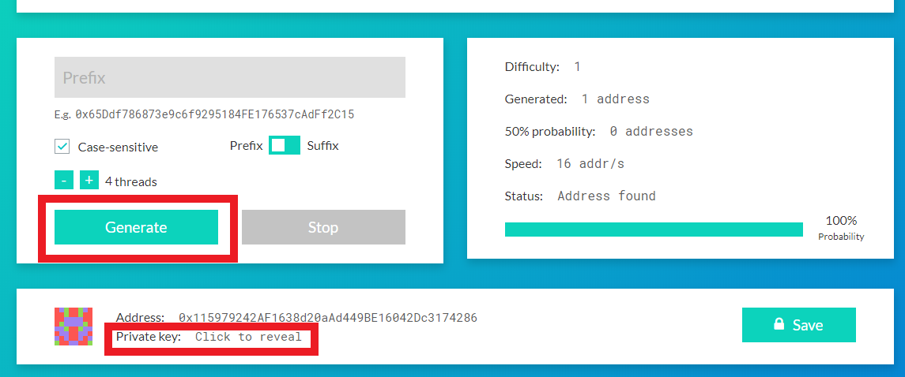

Para empezar, diríjase a [https://www.myetherwallet.com/](https://www.myetherwallet.com/)

- [ ]  Visite [https://www.myetherwallet.com/](https://www.myetherwallet.com/)
- [ ]  Haga clic en el boton que dice "`Onwards!`"

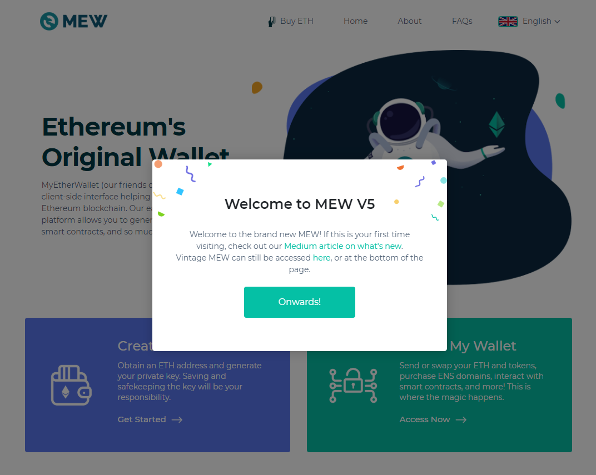

- [ ]  Selecciona la caja que dice, "`Access My Wallet`"

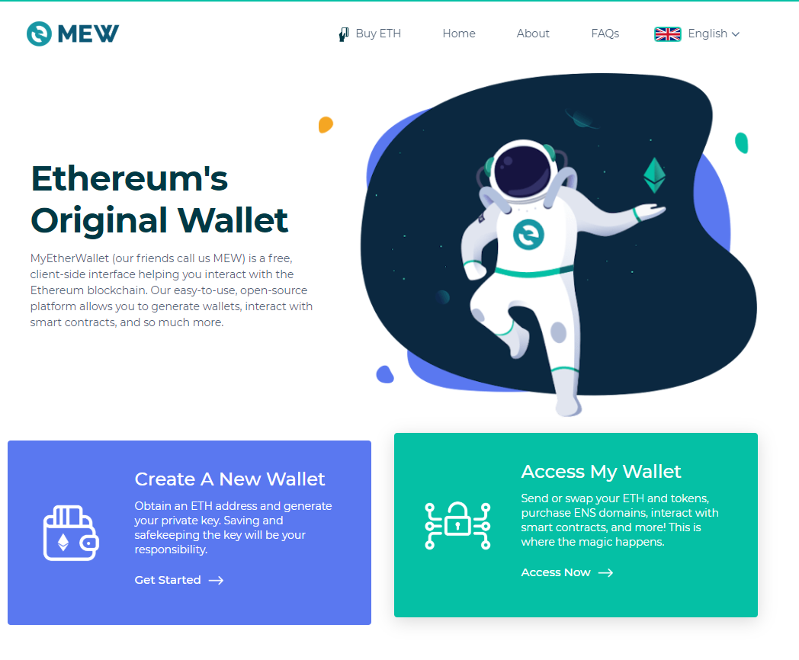

- [ ]  Aparecen cuatro opciones, seleccione la opcion "`Software`".

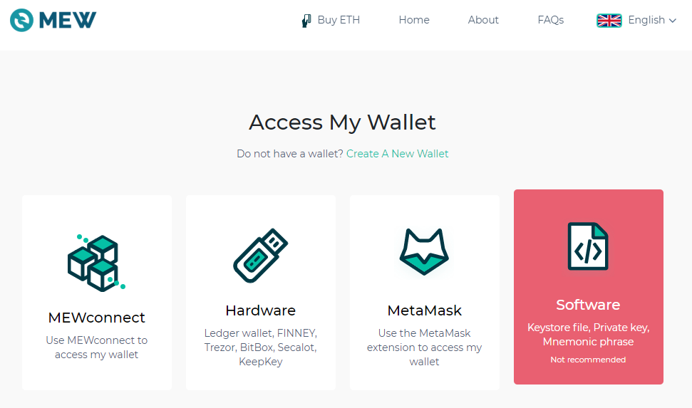

- [ ]  En la siguiente ventana, puede seleccionar un archivo de almacenamiento de claves, una frase mnemotécnica o una clave privada. 
Para esta demostración, utilice la clave privada generada en la sección **Requisitos** de estas instrucciones. Seleccione la opción 
"`Private Key`" y pulse el botón "`Continue`".

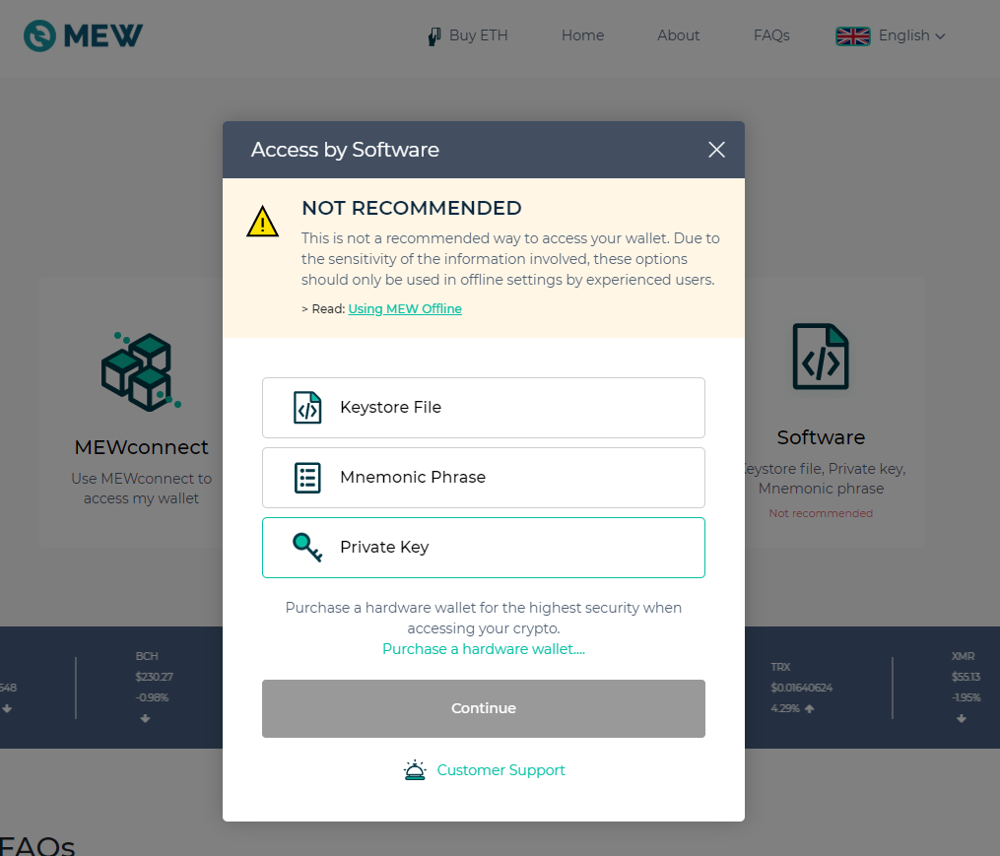

- [ ]  Pegue su **nueva clave privada** generada en la caja de entrada y pulse "`Access Wallet`".

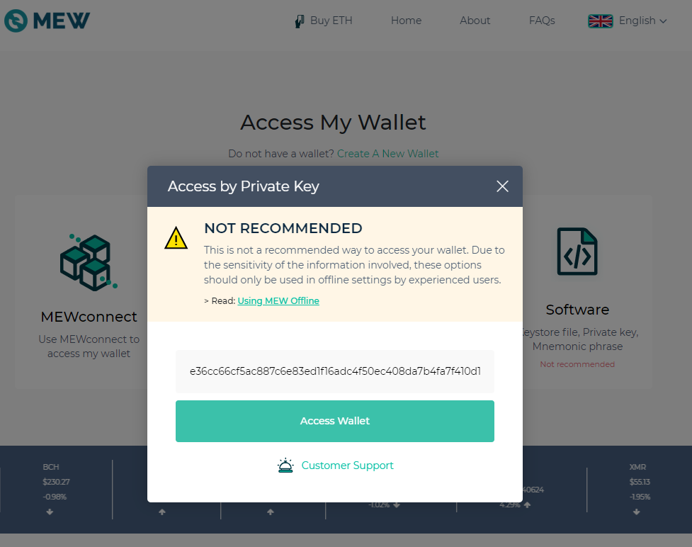

- [ ]  Ahora debería tener una cartera MEW! Verá su dirección, su saldo y su red. La siguiente sección describe cómo 
conectarse a nuestra red de demostración Athereum.

# Conectándose a Athereum

Con la cartera MEW que creó en la sección **Creación de su cartera MEW**, siga los siguientes pasos para conectarse a Athereum.

 -[ ]  En el cuadro de color azul claro en el extremo derecho con la etiqueta "`Network`", haga clic en el botón "`Change`".
 
 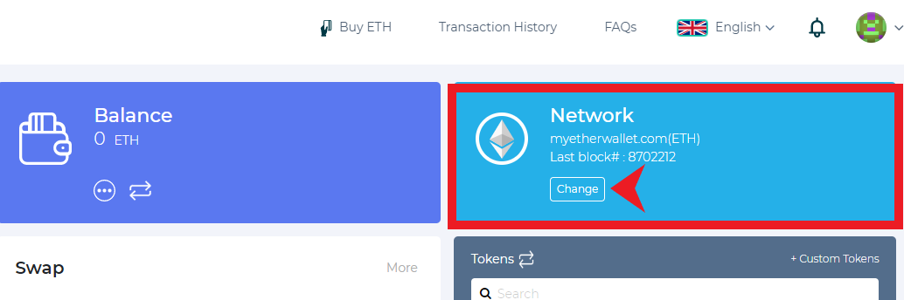

 -[ ]  En la siguiente pantalla, pulse el botón "`Add Custom Network/Node`".
 
 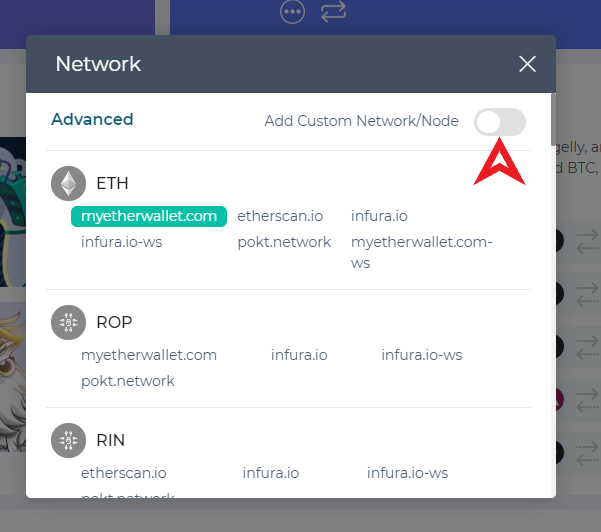

- [ ]  Aparecerá una ventana "`Advanced`" que le pedirá información sobre la red personalizada. Debe aparecer de la siguiente manera.

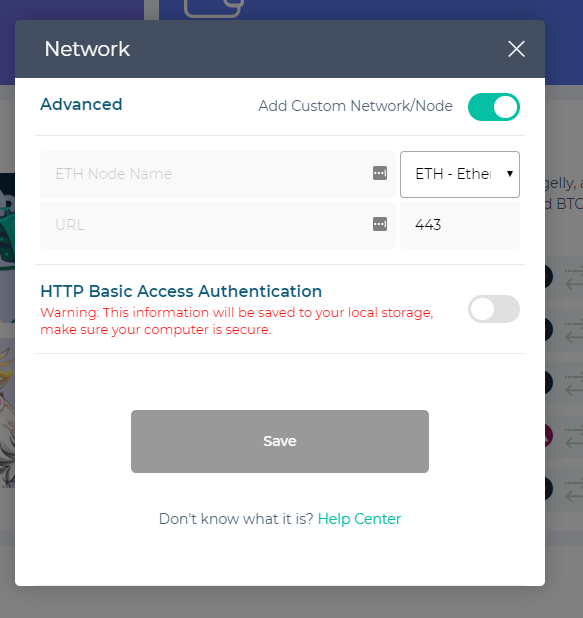

- [ ]   La opción predeterminada es Ethereum Mainnet. Cambie a la opción "`CUS - CUSTOM`" en la parte inferior del menú desplegable 
que se muestra a continuación.

    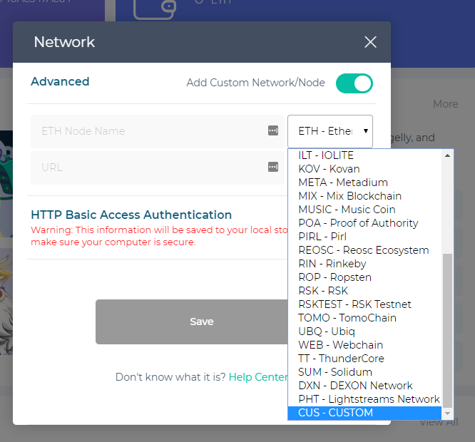
    
- [ ]  Rellene los campos como en la siguiente imagen, con `Port 21015`, `ChainID 43110`, 
`URL https://ava.network/ext/evm/rpc`, `ExplorerTx http://athexplorer.ava.network/tx/[[txHash]]`, y 
`ExplorerAddress http://athexplorer.ava.network/address/[[address]]`. Después haga clic en "`Save`".

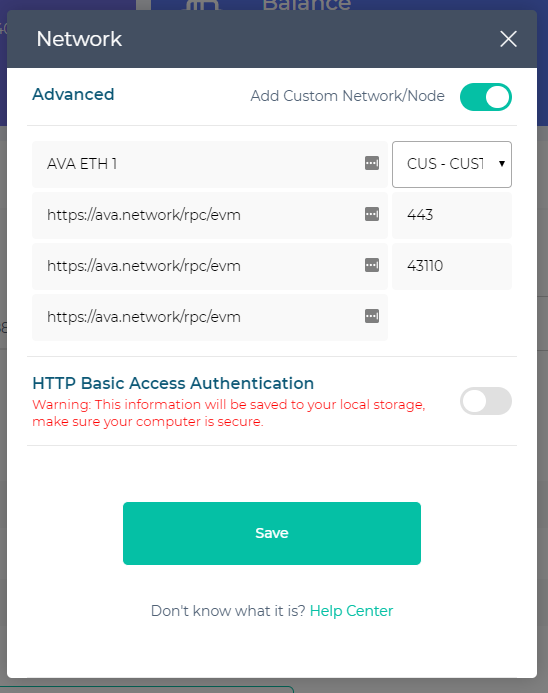

- [ ]   Diríjase a la parte inferior de la ventana Redes y seleccione "`AVA ETH 1 (CUS)`" 
bajo el título "`Custom Networks`" haciendo clic en su nombre.

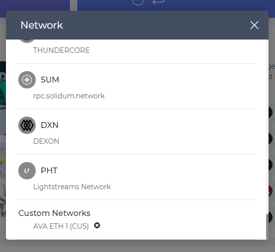

- [ ]   Usted debe ver lo siguiente en la casilla "`Network`" de su cartera cuando lo haya completado (su número de Último Bloque variará).

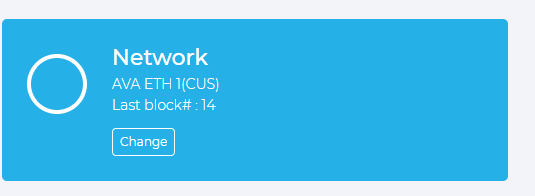

# Interactuando con el contrato

Estamos listos para empezar a interactuar con el contrato inteligente a través de nuestra cartera.

- [ ]  En la barra lateral MEW a la izquierda de su cartera de escritorio, amplíe la opción de menú "Contrato" y haga clic en "`Interact with Contract`".

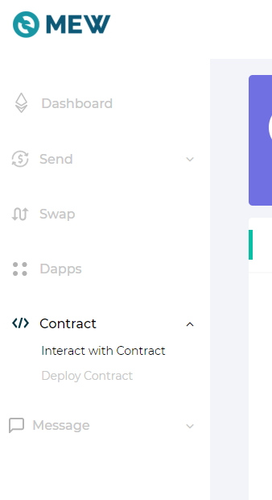

- [ ]  Rellene el campo "`Contract Address`" para que muestre "`0x3A846ECcBd5d0c3395192b38E48958fB15373CeA`" y 
la "`ABI/JSON Interface`" para que tenga el siguiente valor:

[https://gist.github.com/collincusce/d0fe8cea9223bf3ab67a1914173a1e34]
(https://gist.github.com/collincusce/d0fe8cea9223bf3ab67a1914173a1e34)

- [ ]  Presione "`Continue`" para interactuar con el contrato.

    

    - [ ]  Seleccione la función "`getSize`" desde el menú desplegable de la derecha.

    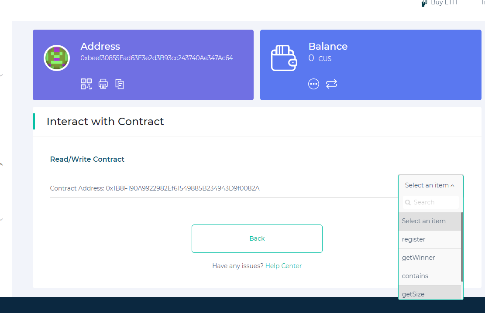

- [ ]  Esto llama a la función "`getSize()`" en el contrato y muestra sus resultados. Anote el valor "`Result`" que aparece después de 
seleccionar la función. Ese número debería aumentar estrictamente a medida que la gente utilice el contrato.

    

    - [ ]   Seleccione ahora la función "`register`" en el menú desplegable de la derecha.

    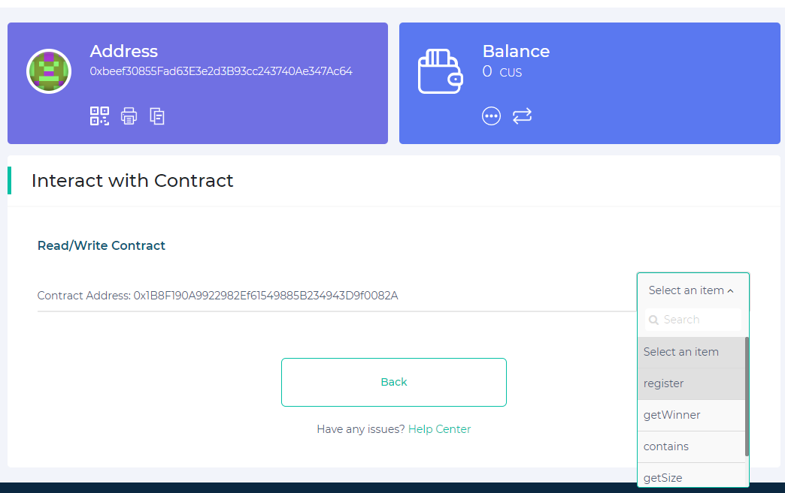

    - [ ]  Deje los campos tal cual y pulse el botón "`Write`" para registrar su dirección en el contrato. *Nota: Sólo puede registrarse una vez por dirección*.

    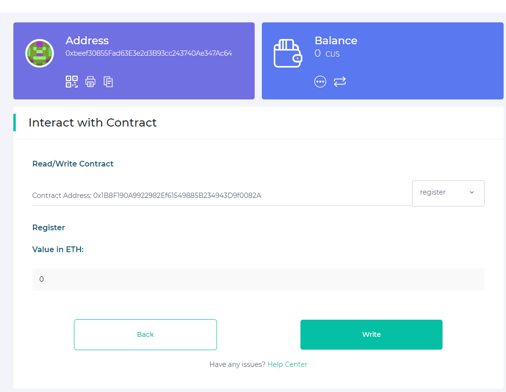

    - [ ]  En las siguientes pantallas, pulse el botón "`Confirm and Send`" seguido del botón "Okay".

    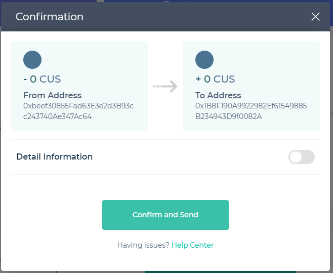

    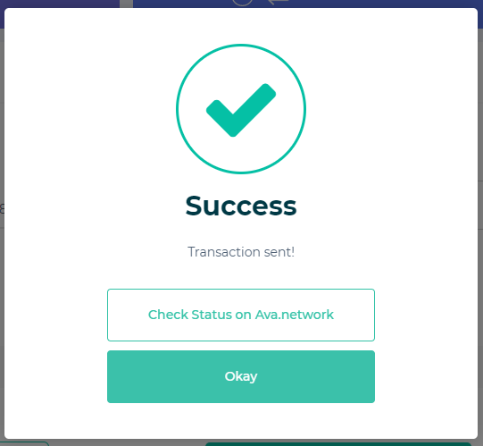

    - [ ]  Seleccione "`getSize`" de nuevo, y verá que el valor "`Result`" ha aumentado. Si varias personas utilizan el contrato, debería aumentar el número de participantes recién inscritos.
    
        

    # Enhorabuena!
    
   Ahora puede interactuar con la red de pruebas de Athereum. Puede implementar e interactuar con los contratos 
   de la misma manera que lo haría con Ethereum mainnet. Hay algunas advertencias adicionales: AVA tiene una finalidad 
   inferior a la segunda, por lo que los bloques se producirán excepcionalmente rápido. Si su sistema depende de un 
   determinado tiempo de bloques, tendrá que ser ajustado para esta nueva velocidad. Además, AVA no requiere confirmaciones 
   como parte de su protocolo. Si su sistema espera confirmaciones, ya no necesita hacerlo, ya que esta versión de Ethereum 
   no utiliza el Consenso de la Cadena Más Larga. Por último, se trata de una red de prueba que utiliza el cliente AVA Alpha, 
   el cual ya se ha hecho público. Conectar nodos geth no modificados no producirá el comportamiento esperado. No hay 
   garantía de disponibilidad. Este sistema aún no se ha endurecido por completo. Si ves algo, dilo enviando un 
   correo electrónico a contact@avalabs.org

    Disfrute! 

    - AVA Team <3

    
    
    
    
